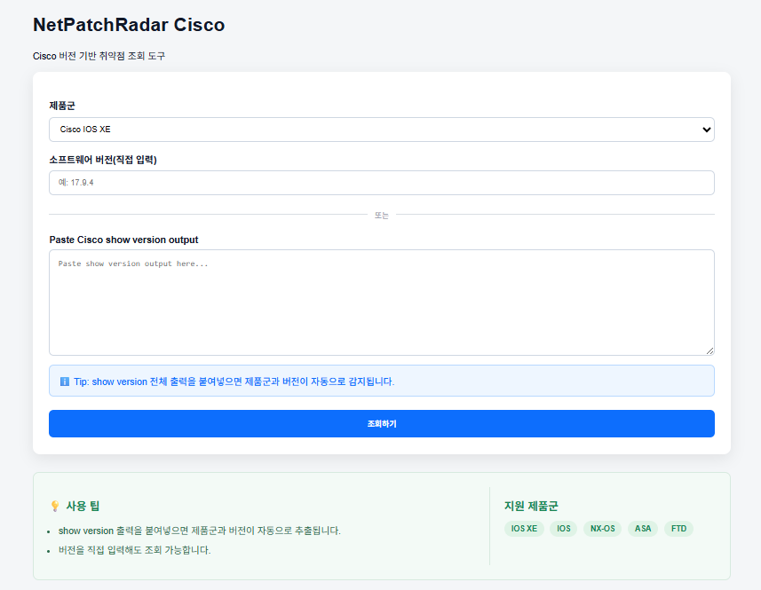
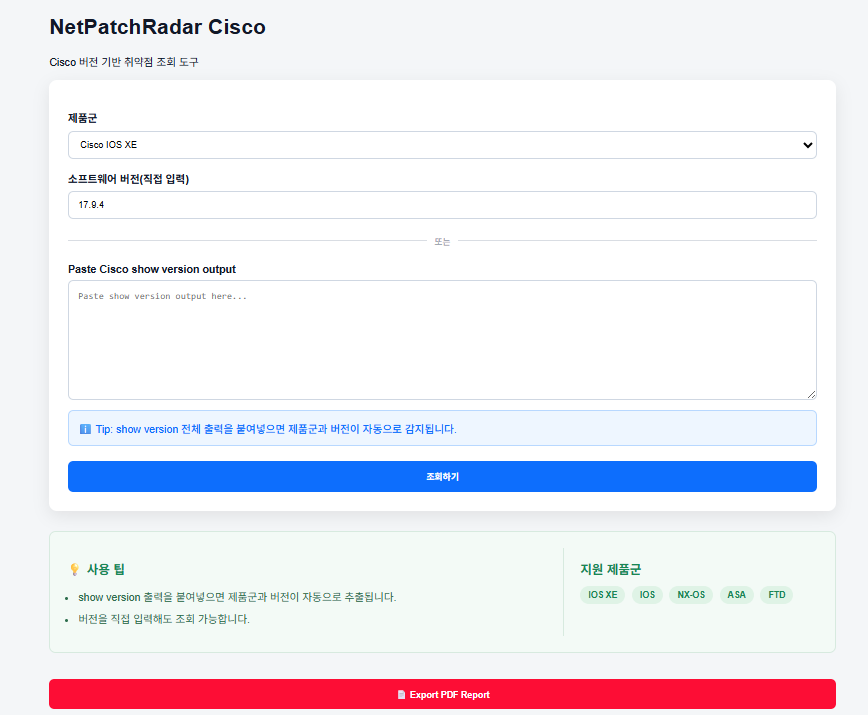
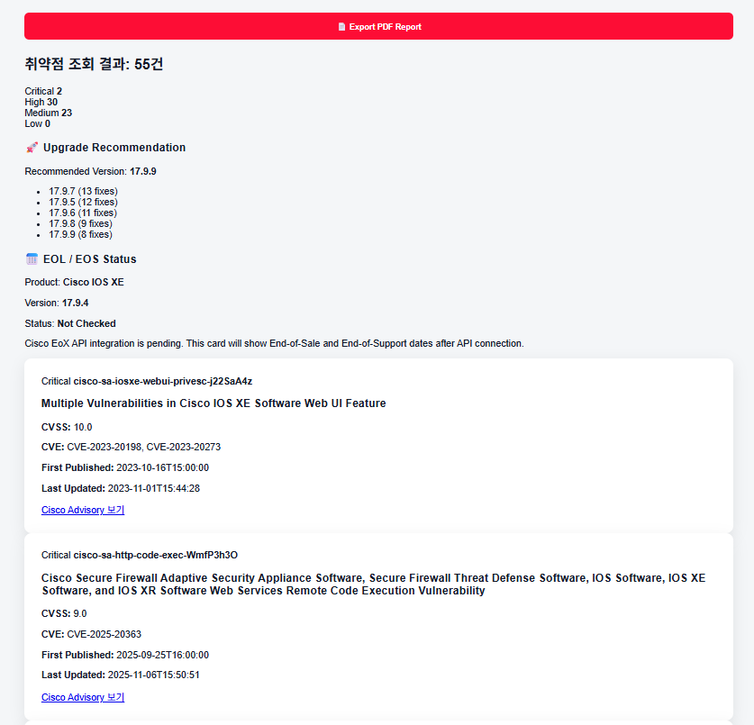
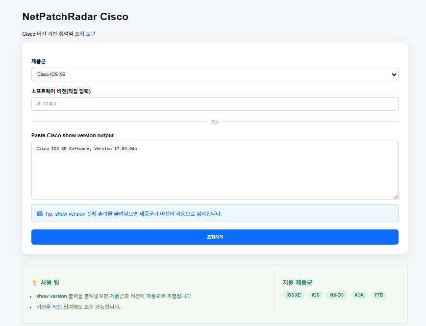
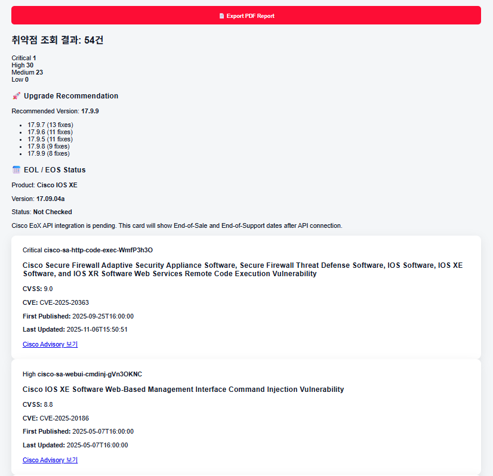
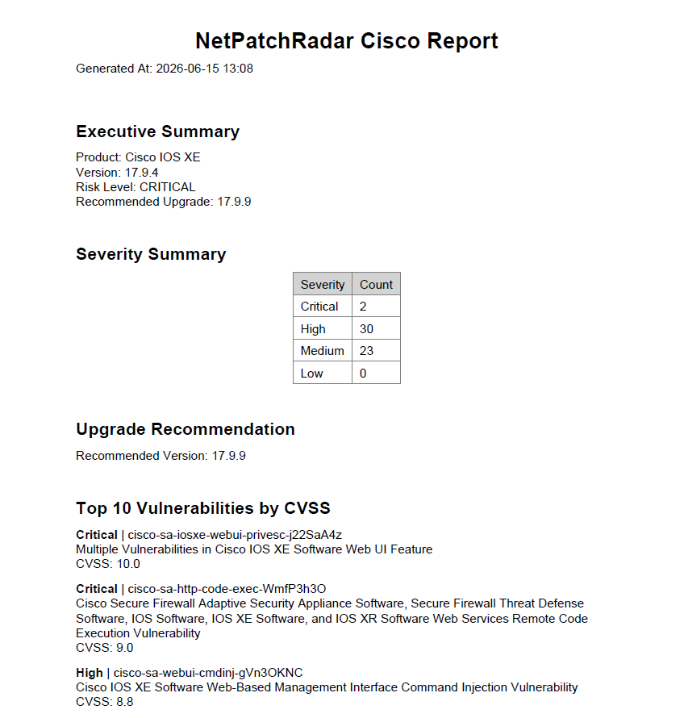

## 🚀 New in v1.0.0

- Cisco Show Version Parser
- Automatic Product Detection
- Automatic Version Extraction
- IOS XE / IOS / NX-OS / ASA / FTD Support
- Improved UI
- PDF Report Export


## What is NetPatchRadar Cisco?

NetPatchRadar Cisco is a vulnerability assessment tool for Cisco network devices powered by the Cisco OpenVuln API.

The tool automatically detects Cisco product families and software versions, retrieves related security advisories, ranks vulnerabilities by CVSS severity, and generates professional PDF assessment reports.

Supported Platforms:

- Cisco IOS XE
- Cisco IOS
- Cisco NX-OS
- Cisco ASA
- Cisco FTD

---
## Use Case

Network engineers often need to determine whether a Cisco software version contains known vulnerabilities.

Traditionally this requires:

- Searching Cisco Security Advisories manually
- Identifying the correct product family
- Comparing software versions
- Reviewing multiple CVEs individually

NetPatchRadar Cisco automates this workflow and provides results within seconds.

## Prerequisites

A Cisco Developer account is required to obtain OpenVuln API credentials.

Register and request API access through the Cisco Developer Portal.

Cisco Developer Portal: https://developer.cisco.com

## Features

- Cisco OpenVuln API Integration
- CVSS-Based Vulnerability Ranking
- Severity Dashboard
- Upgrade Recommendation Engine
- PDF Security Report Export
- Show Version Parser
- Automatic Product Detection
- Automatic Version Detection
---

## Supported Products

- Cisco IOS XE
- Cisco IOS
- Cisco NX-OS
- Cisco ASA
- Cisco FTD

---

## Screenshots

### Dashboard



### Example-1



### Example-2



### PDF Report



---

## Installation

```bash
git clone https://github.com/southK0rean/NetPatchRadar-Cisco.git

cd NetPatchRadar-Cisco

pip install -r requirements.txt
```

---

## Environment Variables

Create a `.env` file in the project root directory.

```env
CLIENT_ID=your_client_id
CLIENT_SECRET=your_client_secret
```

Cisco API credentials can be obtained from the Cisco Developer Portal.

---

## Run

```bash
python app.py
```

Open your browser and navigate to:

```text
http://127.0.0.1:5000
```

---

## Example Workflow

1. Select Cisco product type
2. Enter software version
3. Run vulnerability assessment
4. Review Severity Dashboard
5. Review recommended upgrade version
6. Export PDF security report

Alternative Workflow

1. Paste Cisco "show version" output
2. Product and version are detected automatically
3. Run vulnerability assessment
4. Review Severity Dashboard
5. Review recommended upgrade version
6. Export PDF security report
---

## Sample Output

- Vulnerability Summary
- Critical / High / Medium / Low Counts
- Recommended Upgrade Version
- Top Vulnerabilities by CVSS
- PDF Executive Summary Report

---

## Roadmap

### v1.0

- Cisco OpenVuln Integration
- Severity Dashboard
- Upgrade Recommendation
- PDF Report Export
- Show Version Parser
- Automatic Product Detection
- Automatic Version Detection

### Future Plans

- Cisco EoX / Lifecycle Integration
- Suggested Release Analysis
- Configuration Parsing
- Multi-Vendor Support

---

## Disclaimer

This project is an independent tool and is not affiliated with Cisco Systems.

Cisco trademarks and product names belong to Cisco Systems, Inc.
