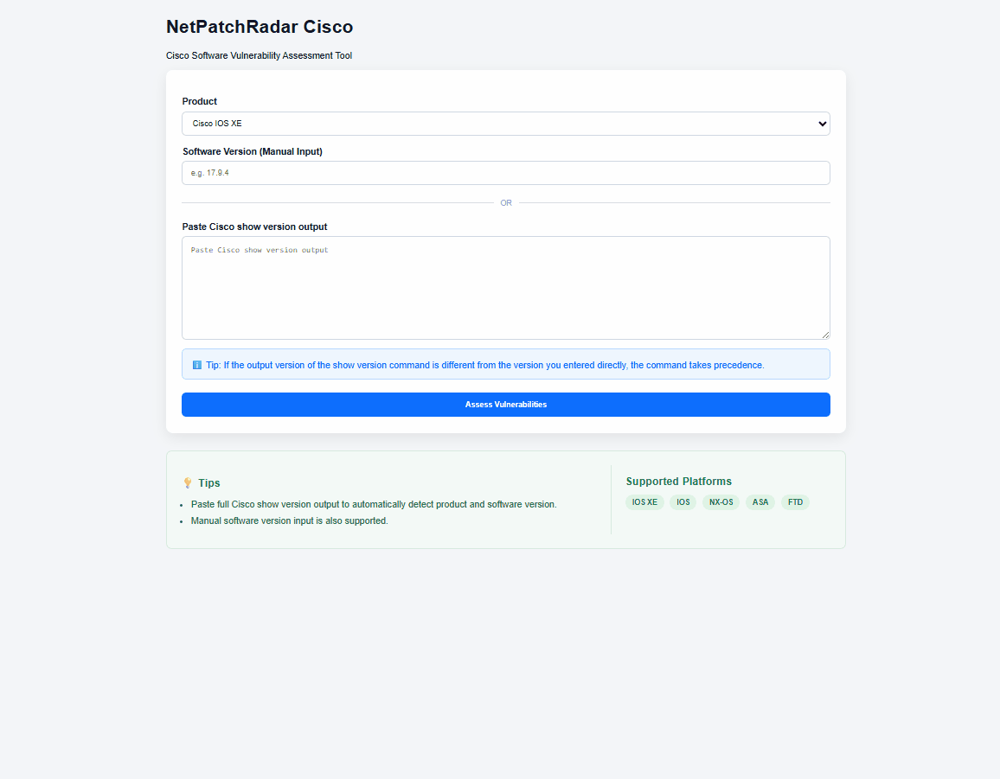
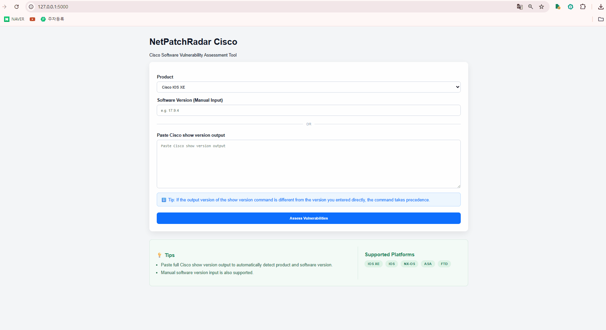

# NetPatchRadar Cisco

Cisco Software Vulnerability Assessment Tool powered by Cisco OpenVuln API.

NetPatchRadar Cisco helps network engineers quickly identify software vulnerabilities, review risk levels, and generate security assessment reports for Cisco platforms.

---

## Use Case

Network engineers often need to determine whether a Cisco software version contains known vulnerabilities.

Traditionally this requires:

- Searching Cisco Security Advisories manually
- Identifying the correct product family
- Comparing software versions
- Reviewing multiple CVEs individually

NetPatchRadar Cisco automates this workflow and provides results within seconds.

---

## Features

- Cisco OpenVuln API Integration
- CVSS-Based Vulnerability Ranking
- Severity Dashboard
- Upgrade Recommendation Engine
- PDF Security Report Export
- Show Version Parser
- Automatic Product Detection
- Automatic Version Detection

---

## Screenshots

### Example


---

## Demo

### Manual Version Input


### Show Version Parser


### PDF Report Export


---

## Installation

```bash
git clone https://github.com/southK0rean/NetPatchRadar-Cisco.git

cd NetPatchRadar-Cisco

python -m venv venv

# Windows
venv\Scripts\activate

pip install -r requirements.txt
```

---

## Environment Variables

Create a `.env` file in the project root directory.

```env
CLIENT_ID=your_client_id
CLIENT_SECRET=your_client_secret
```

Cisco API credentials can be obtained from the Cisco Developer Portal.

---

## Run

```bash
python app.py
```

Open your browser and navigate to:

```text
http://127.0.0.1:5000
```

---

## Example Workflow

1. Select Cisco product type
2. Enter software version
3. Run vulnerability assessment
4. Review Severity Dashboard
5. Review recommended upgrade version
6. Export PDF security report

Alternative Workflow

1. Paste Cisco "show version" output
2. Product and version are detected automatically
3. Run vulnerability assessment
4. Review Severity Dashboard
5. Review recommended upgrade version
6. Export PDF security report
---

## Sample Output

- Vulnerability Summary
- Critical / High / Medium / Low Counts
- Recommended Upgrade Version
- Top Vulnerabilities by CVSS
- PDF Executive Summary Report

---

## Roadmap

### v1.0

- Cisco OpenVuln Integration
- Severity Dashboard
- Upgrade Recommendation
- PDF Report Export
- Show Version Parser
- Automatic Product Detection
- Automatic Version Detection

### Future Plans

- Cisco EoX / Lifecycle Integration
- Suggested Release Analysis
- Configuration Parsing
- Multi-Vendor Support
---

## Prerequisites & Security

A Cisco Developer account is required to obtain OpenVuln API credentials.

Register and request API access through the Cisco Developer Portal.

NetPatchRadar Cisco does not store Cisco API credentials.

Credentials are loaded from environment variables and are never written to disk, logs, or exported reports.

Required variables:

- CLIENT_ID
- CLIENT_SECRET

Cisco Developer Portal: <https://developer.cisco.com>
---

## Architecture

```text
User
 │
 ▼
Flask Web UI
 │
 ▼
Version Parser
 │
 ▼
Cisco OpenVuln API
 │
 ▼
Assessment Engine
 │
 ▼
PDF Report Generator
```

---
## Disclaimer

This project is an independent tool and is not affiliated with Cisco Systems.

Cisco trademarks and product names belong to Cisco Systems, Inc.